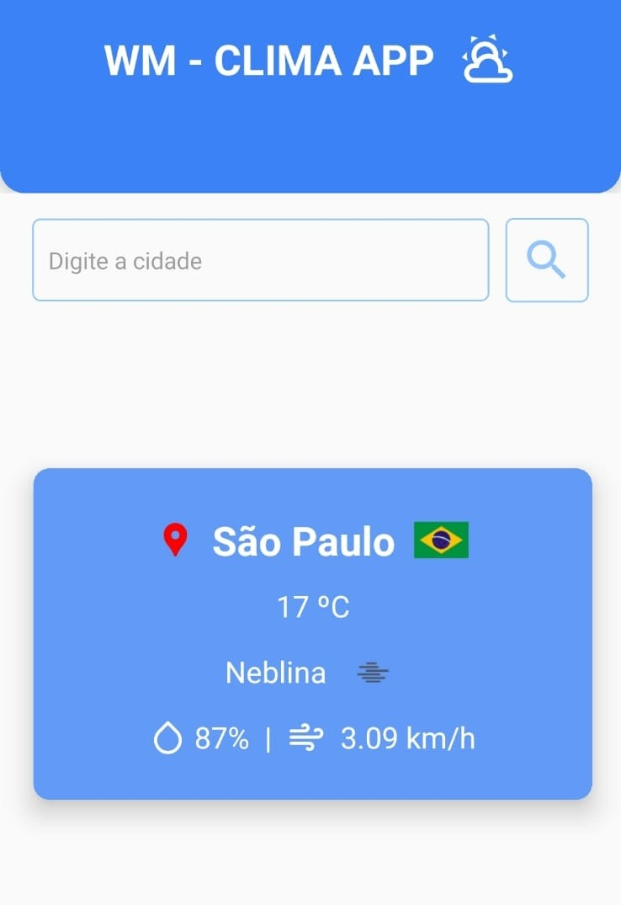

# WM - Aplicativo de Previsão do Tempo com Sugestões de Viagem

Seu guia completo para o clima e suas próximas aventuras.

## Descrição
O WM é um aplicativo mobile desenvolvido com React Native que oferece previsões do tempo precisas e detalhadas para qualquer cidade do mundo. Com o WM, você pode:

* Pesquisar a previsão do tempo para qualquer cidade
* Verificar temperatura, umidade, velocidade do vento e outras informações relevantes
* Receber sugestões de atividades e pontos turísticos personalizados para sua viagem, gerados pela IA Gemini

## Tecnologias Utilizadas
* **React Native:** Framework para desenvolvimento de aplicativos mobile multiplataforma
* **Fetch:** Para realizar requisições HTTP
* **Styled-components:** Biblioteca de estilização para React Native
* **OpenWeatherMap API:** API para obter dados meteorológicos

## Instalação
1. Clone este repositório: `git clone https://github.com/MetzkerDeveloper/clima-app.git`
2. Instale as dependências: `cd wm-clima-app && npm install`
3. Configure sua chave de API da OpenWeatherMap  e do Gemini no arquivo `.env`
4. Execute o aplicativo: `npx expo start`

## Contribuições
Contribuições são bem-vindas! Para contribuir, por favor, siga as seguintes etapas:

1. Fork este repositório
2. Crie um novo branch
3. Faça suas alterações
4. Abra um Pull Request

## Licença
Este projeto está licenciado sob a licença MIT.

